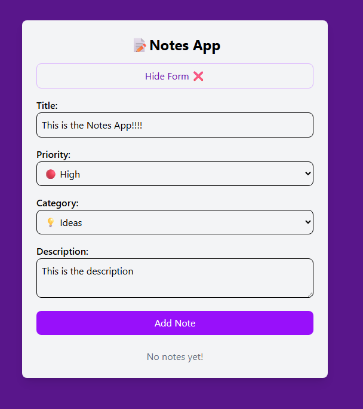

# React + Vite

This template provides a minimal setup to get React working in Vite with HMR and some ESLint rules.

Currently, two official plugins are available:

- [@vitejs/plugin-react](https://github.com/vitejs/vite-plugin-react/blob/main/packages/plugin-react) uses [Babel](https://babeljs.io/) for Fast Refresh
- [@vitejs/plugin-react-swc](https://github.com/vitejs/vite-plugin-react/blob/main/packages/plugin-react-swc) uses [SWC](https://swc.rs/) for Fast Refresh

A simple notes application I built while learning **React**.
This project helped me practice modern frontend development concepts such as components, props, form creation, and state management.

## ✨ Features
- Add and delete notes
- Assign priorities (High / Medium / Low)
- Add a description
- Your notes don;t disappear even after refresshing the page
- Priority-based color indicators for quick visual reference
- Clean and minimal UI

## 🛠 Tech Stack
- React (with Vite)
- JavaScript (ES6+)
- HTML & CSS

